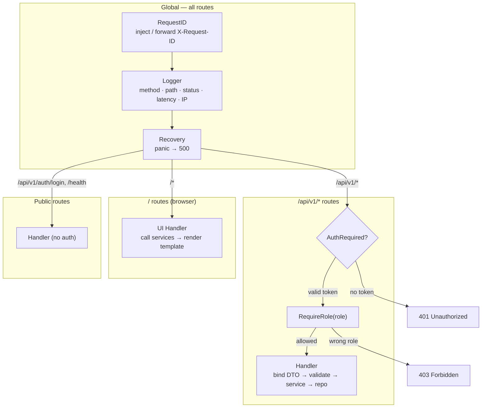
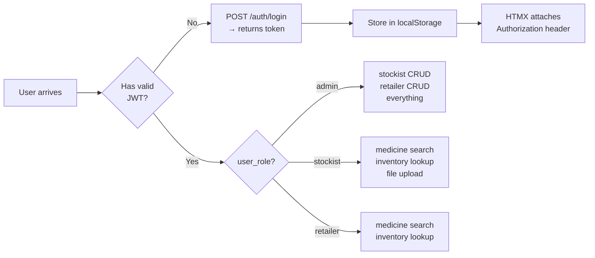
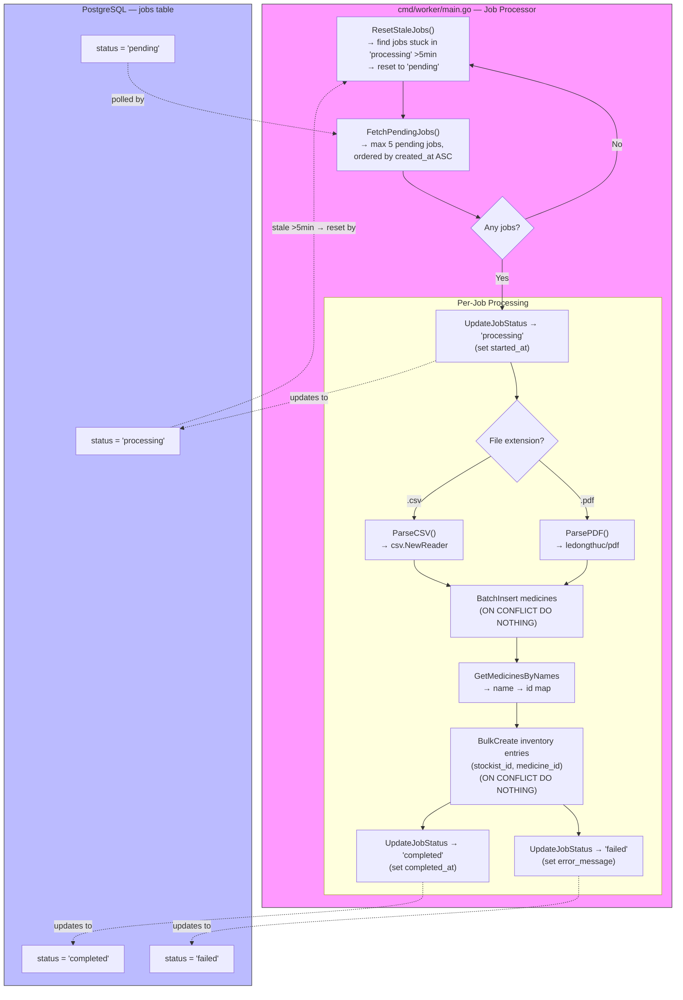
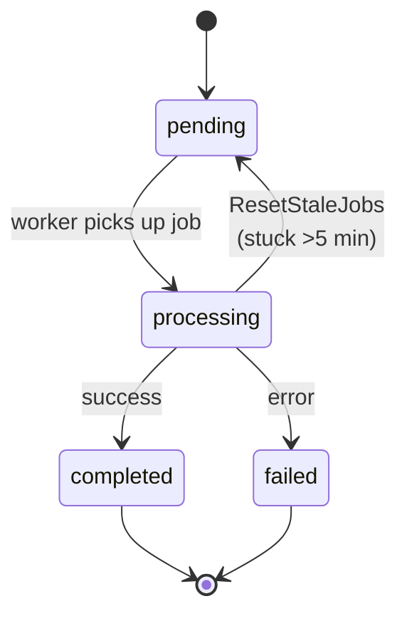
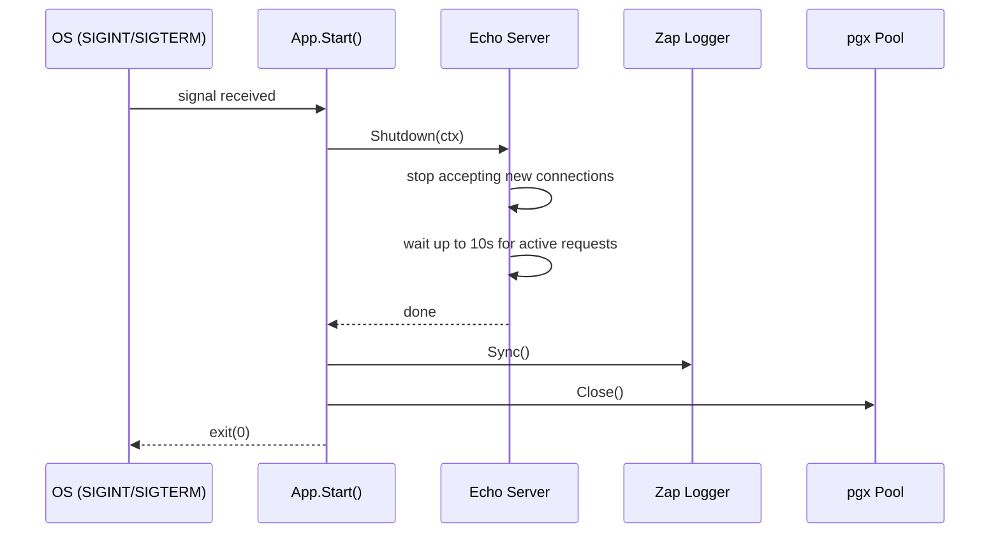

# Architecture

## Project Structure

```
pharmastock-backend/
├── cmd/
│   ├── api/main.go               # API server entry point
│   └── worker/main.go            # Background job worker entry point
│
├── internal/
│   ├── app/app.go                # Bootstrap, DI wiring, graceful shutdown
│   ├── common/response.go        # APISuccessResponse / APIErrorResponse helpers
│   ├── config/config.go          # Env-based config parsing
│   ├── database/postgres.go      # pgxpool init (min 2, max 10 connections)
│   │
│   ├── middleware/
│   │   ├── request_id.go         # X-Request-ID generation/forwarding
│   │   ├── logger.go             # Zap structured request logging
│   │   ├── recovery.go           # Panic → 500
│   │   └── rate_limit.go         # IP-based: 100 req / 5 min
│   │
│   ├── health/health.go          # GET /health — API + DB status
│   │
│   ├── auth/                     # Auth, JWT, RBAC middleware
│   │   ├── module.go             # → Module{Handler, Service}
│   │   ├── handler.go            # Login, RegisterRetailer, AdminCreateStockist
│   │   ├── service.go            # Login, CreateUser, SeedAdmin
│   │   ├── repository.go         # User CRUD
│   │   ├── middleware.go         # AuthRequired, RequireRole
│   │   ├── jwt.go                # HS256 generate + validate (24h)
│   │   ├── password.go           # bcrypt hash + verify
│   │   ├── model.go              # User, Claims, DTOs
│   │   └── routes.go
│   │
│   ├── stockist/                 # Distributor module
│   │   ├── module.go → handler, service, repository, model, dto, routes
│   │   └── validator.go
│   │
│   ├── retailer/                 # Pharmacy module
│   ├── medicine/                 # Global catalog + CSV/PDF parsers
│   ├── inventory/                # Stockist-Medicine join
│   ├── upload/                   # File upload + job creation
│   ├── job/                      # Background job model + processor
│   │
│   ├── ui/                       # Browser testing interface
│   │   ├── handler.go            # Page/form handlers
│   │   ├── renderer.go           # Per-page template clones
│   │   ├── module.go
│   │   ├── routes.go
│   │   └── templates/
│   │       ├── layout.gohtml
│   │       ├── partials.gohtml
│   │       ├── login.gohtml, dashboard.gohtml
│   │       ├── stockists.gohtml, retailers.gohtml
│   │       ├── medicines.gohtml, inventory.gohtml
│   │       └── upload.gohtml
│   │
│   └── router/router.go          # Route hub — middleware per group
│
├── migrations/                   # 6 migration pairs (up/down)
├── docs/
│   ├── SYSTEM_DESIGN.md
│   ├── ARCHITECTURE.md
│   └── openapi.yaml
│
├── docker-compose.yml
├── .env.example
├── go.mod / go.sum
└── pharmastock.png
```

---

## Module Pattern

Every feature module follows the same convention:

```
module/
├── model.go        # Domain types (pure Go, no JSON tags)
├── dto.go          # Request/response DTOs with validation tags
├── repository.go   # Interface + pgx implementation
├── service.go      # Interface + business logic
├── handler.go      # HTTP handlers
├── routes.go       # Route registration on echo.Group
├── validator.go    # Struct validator (if needed)
└── module.go       # DI wiring → Module{Handler, Service}
```

**Standard return type:**

```go
type Module struct {
    Handler *Handler
    Service Service
}
```

**UI module exception:**

```go
type Module struct {
    Handler  *Handler          # Page/form HTTP handlers
    Renderer *TemplateRenderer # Registered as e.Renderer
}
```

---

## Middleware Pipeline



### Per-group middleware

| Route Group | Middleware |
|---|---|
| `/api/v1/auth/login` | — (public) |
| `/api/v1/auth/register` | — (public) |
| `/api/v1/health` | — (public) |
| `/api/v1/auth/admin/*` | `AuthRequired` + `RequireRole("admin")` |
| `/api/v1/medicines`, `/api/v1/inventory` | `AuthRequired` |
| `/api/v1/stockists`, `/api/v1/retailers` | `AuthRequired` + `RequireRole("admin")` |
| `/api/v1/upload` | `AuthRequired` + `RequireRole("stockist")` |
| `/` (UI — all routes) | public (JWT stored in browser localStorage) |

---

## Template Rendering

```mermaid
flowchart TB
    subgraph Base["Shared Templates"]
        L["layout.gohtml<br/>{{define \"layout\"}}<br/>HTML shell + nav + HTMX + Alpine.js"]
        P["partials.gohtml<br/>{{define \"stockists_list\"}}<br/>{{define \"stockist_form\"}}<br/>... (reusable fragments)"]
    end

    subgraph Pages["Per-Page Files"]
        LOGIN["login.gohtml"]
        DASH["dashboard.gohtml"]
        STK["stockists.gohtml"]
        RTL["retailers.gohtml"]
        MED["medicines.gohtml"]
        INV["inventory.gohtml"]
        UPL["upload.gohtml"]
    end

    subgraph Clones["Renderer creates 1 clone per page"]
        C1["login clone = base + login.gohtml"]
        C2["dashboard clone = base + dashboard.gohtml"]
        C3["stockists clone = base + stockists.gohtml"]
        C4["..."]
    end

    REQ{"Request type?"}

    REQ -->|"Full page navigation<br/>(no HX-Request header)"| PAGE["Execute 'layout' from page's clone<br/>→ finds its own {{define \"content\"}}"]
    REQ -->|"HTMX partial request<br/>(HX-Request: true)"| PARTIAL["Execute named partial<br/>directly from shared base set"]

    PAGE --> PAGE_HTML["Full HTML page"]
    PARTIAL --> FRAG["HTML fragment<br/>(replaces target element)"]

    Clones --> PAGE
    Base --> Clones
```

---

## Auth Flow & JWT

### Token structure (HS256, 24h expiry)

```json
{
  "user_id": 1,
  "email": "admin@example.com",
  "role": "admin",
  "reference_id": 0
}
```

Claims extracted by `AuthRequired` middleware and accessible via:

| Context Helper | Returns |
|---|---|
| `auth.GetUserID(c)` | `int64` — user's primary key |
| `auth.GetUserRole(c)` | `string` — `admin`, `stockist`, or `retailer` |
| `auth.GetReferenceID(c)` | `int64` — FK to `stockists.id` or `retailers.id` (0 for admin) |

### Role capabilities



### User creation

| User Type | Created By | Endpoint |
|---|---|---|
| **Admin** | Seeded on startup | `ADMIN_USERNAME` / `ADMIN_PASSWORD` / `ADMIN_EMAIL` env vars |
| **Stockist** | Admin | `POST /api/v1/auth/admin/stockists` |
| **Retailer** | Self-registration | `POST /api/v1/auth/register` |

---

## Background Worker



### Job state machine



---

## Error Handling

### Sentinel errors → HTTP status

| Sentinel | HTTP | When |
|---|---|---|
| `ErrNotFound` | `404 Not Found` | Resource not found |
| `ErrDuplicateEmail` | `409 Conflict` | Duplicate email on create |
| `ErrDuplicateUsername` | `409 Conflict` | Duplicate username |
| `ErrInvalidCredentials` | `401 Unauthorized` | Wrong email/password |
| Rate limit | `429 Too Many Requests` | >100 req / 5 min per IP |

### Response envelope

```json
{"success": true, "data": { ... }}

{"success": false, "error": "descriptive message"}

{
  "success": true,
  "data": {
    "items": [ ... ],
    "total": 42,
    "page": 1,
    "limit": 20,
    "total_pages": 3
  }
}
```

---

## Graceful Shutdown



```go
func (a *App) Start(ctx context.Context) error {
    sc := echo.StartConfig{
        Address:         ":" + a.Config.AppPort,
        GracefulTimeout: 10 * time.Second,
    }
    return sc.Start(ctx, a.Echo)
}
```

---

## Performance Considerations

- **pgx connection pooling** — min 2, max 10, 1h max lifetime, 30m max idle
- **pg_trgm GIN index** — fuzzy text search on medicine names
- **Rate limiting** — 100 req / 5 min per IP
- **Batch inserts** — `BatchInsert` / `BulkCreate` use single round-trip SQL
- **ON CONFLICT DO NOTHING** — idempotent, no error handling for duplicates
- **Polling interval** — 10s (tunable), suitable for moderate upload volume
- **No N+1** — all lookups fetch complete result sets
- **Template clones** — pre-compiled per-page, no runtime collision overhead
