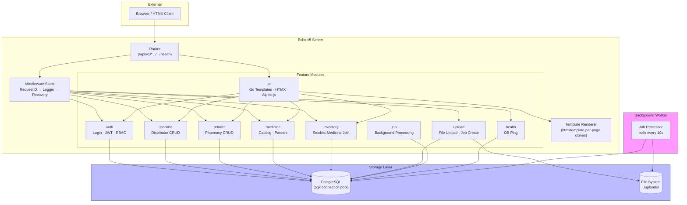
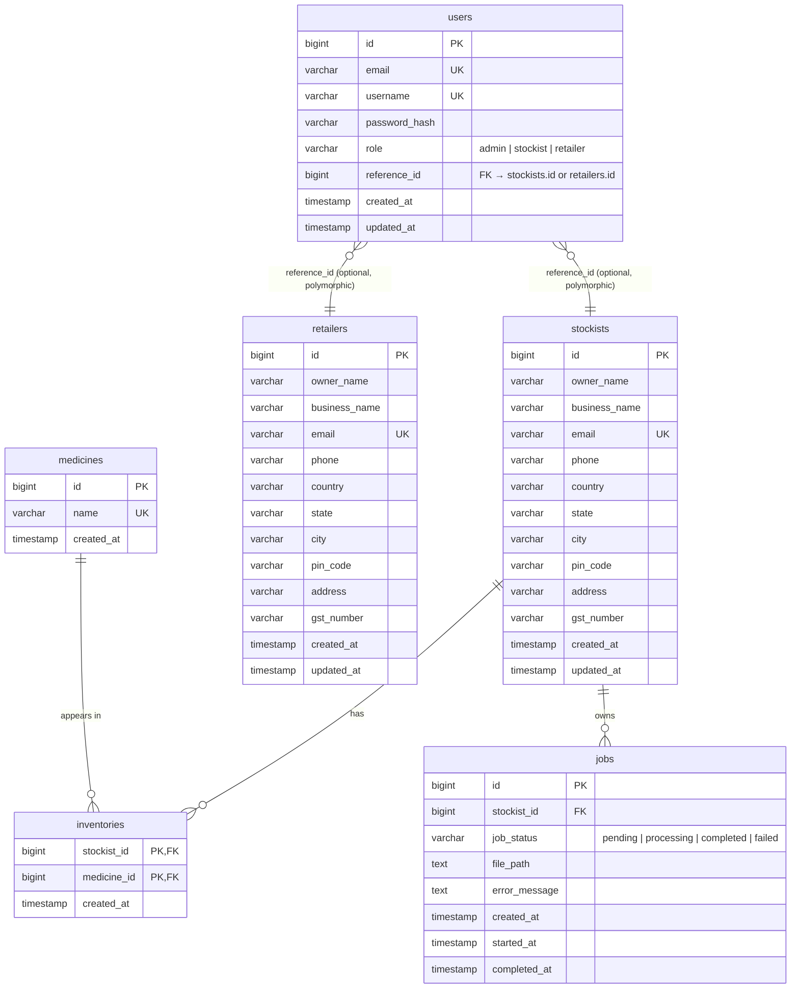
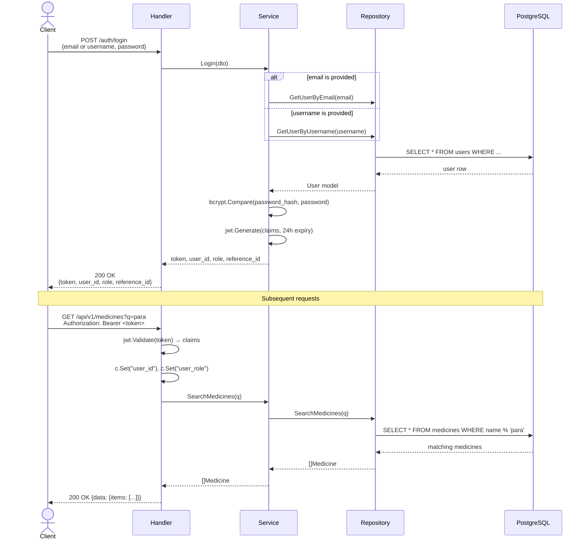
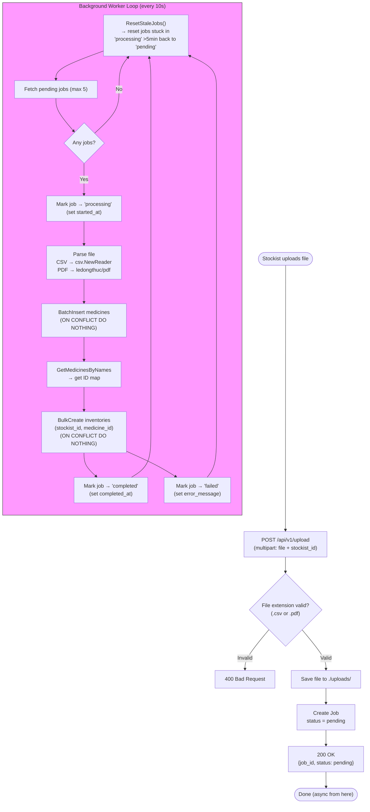
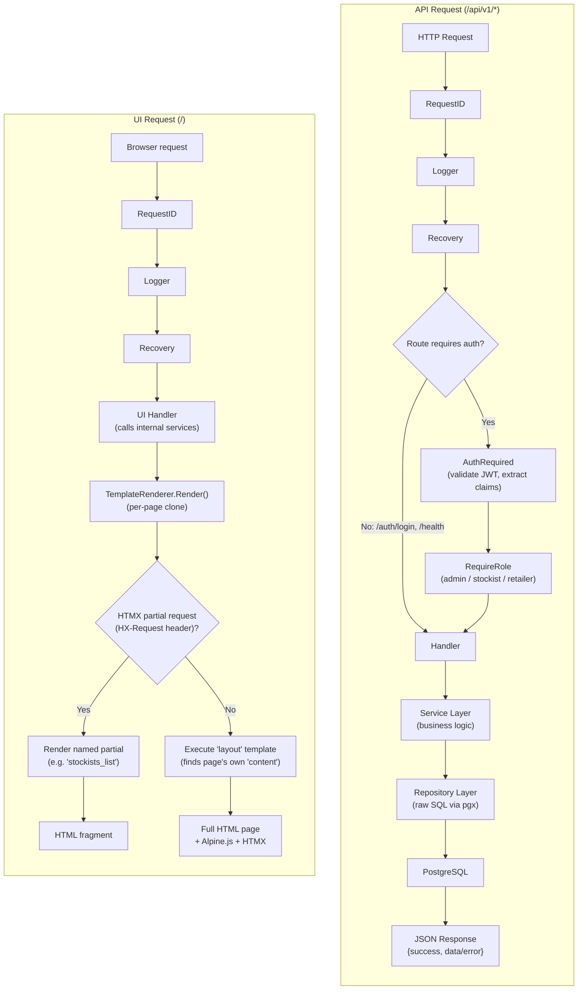

# System Design

## Overview

PharmaStock is a **feature-first modular monolith** — each business domain is self-contained with its own handler, service, repository, model, DTO, and routes linked via dependency injection. This avoids microservice overhead while keeping clear boundaries for future extraction.

---

## System Architecture



### What runs where

| Process | Binary | Command | Purpose |
|---|---|---|---|
| **API Server** | `cmd/api/main.go` | `go run ./cmd/api` | Serves HTTP (API + UI), handles file uploads, creates jobs |
| **Worker** | `cmd/worker/main.go` | `go run ./cmd/worker` | Polls DB for pending jobs, processes files asynchronously |

---

## Domain Model

### Entity-Relationship Diagram



### Entity Roles

| Entity | What it is | Key Relationships |
|---|---|---|
| **Stockist** | Distributor who supplies medicines | owns Inventory records, owns Jobs |
| **Retailer** | Pharmacy who buys medicines | standalone (no direct FKs yet) |
| **Medicine** | A single medicine in the global catalog | appears in many Inventories |
| **Inventory** | Join record — "this stockist carries this medicine" | links Stockist ↔ Medicine |
| **Job** | Processing record for a file upload | belongs to a Stockist |
| **User** | Login credential with role | optionally linked to Stockist or Retailer via `reference_id` |

---

## User Roles & Permissions

| Role | Created By | Routes |
|---|---|---|
| **admin** | Seeded from env vars on startup | Everything |
| **stockist** | Admin creates via `POST /auth/admin/stockists` | Medicine search, inventory lookup, file upload |
| **retailer** | Self-registers via `POST /auth/register` | Medicine search, inventory lookup |

---

## Key Flows

### 1. Authentication (login → JWT → protected request)



### 2. Inventory Upload & Background Processing



### 3. Request Lifecycle (API vs UI)



---

## Design Decisions

| Decision | Rationale |
|---|---|
| **Modular monolith** | Clear domain boundaries without microservice overhead |
| **Raw SQL / pgx** | Full query control, no ORM hidden N+1 |
| **DTOs ≠ domain models** | API contract changes don't affect internal logic; domain models have no JSON tags |
| **Sentinel errors** | `ErrNotFound` → 404, `ErrDuplicateEmail` → 409; handled via `errors.Is()` |
| **pg_trgm GIN index** | Fuzzy medicine name search with trigram similarity |
| **ON CONFLICT DO NOTHING** | Idempotent inserts — no duplicate error handling needed |
| **Polling-based worker** | Simple, no external queue; reset stale jobs every cycle |
| **Per-page template clones** | Prevents `{{define "content"}}` collisions; each page has its own template set |
| **HTMX + Alpine.js** | Server-rendered HTML, minimal JS, no SPA build step |

---

## Database Schema

### Migration Sequence

| # | Migration | Adds |
|---|---|---|
| 000001 | `create_stockists` | `stockists` table |
| 000002 | `create_inventory_jobs` | `jobs` table |
| 000003 | `create_retailers` | `retailers` table |
| 000004 | `create_medicines` | `medicines` table + `pg_trgm` extension + GIN index |
| 000005 | `create_inventories` | `inventories` table (composite PK) |
| 000006 | `create_users` | `users` table + role CHECK constraint |

### SQL Definitions

<details>
<summary>users</summary>

```sql
CREATE TABLE users (
    id            BIGSERIAL PRIMARY KEY,
    email         VARCHAR(255) NOT NULL UNIQUE,
    username      VARCHAR(100) NOT NULL UNIQUE,
    password_hash VARCHAR(255) NOT NULL,
    role          VARCHAR(20)  NOT NULL CHECK (role IN ('admin','stockist','retailer')),
    reference_id  BIGINT,                           -- FK to stockists.id or retailers.id
    created_at    TIMESTAMP NOT NULL DEFAULT CURRENT_TIMESTAMP,
    updated_at    TIMESTAMP NOT NULL DEFAULT CURRENT_TIMESTAMP
);
```
</details>

<details>
<summary>stockists</summary>

```sql
CREATE TABLE stockists (
    id            BIGSERIAL PRIMARY KEY,
    owner_name    VARCHAR(255) NOT NULL,
    business_name VARCHAR(255) NOT NULL,
    email         VARCHAR(255) NOT NULL UNIQUE,
    phone         VARCHAR(20)  NOT NULL,
    country       VARCHAR(100) NOT NULL,
    state         VARCHAR(100) NOT NULL,
    city          VARCHAR(100) NOT NULL,
    pin_code      VARCHAR(20)  NOT NULL,
    address       VARCHAR(255) NOT NULL,
    gst_number    VARCHAR(50)  NOT NULL,
    created_at    TIMESTAMP NOT NULL DEFAULT CURRENT_TIMESTAMP,
    updated_at    TIMESTAMP NOT NULL DEFAULT CURRENT_TIMESTAMP
);
```
</details>

<details>
<summary>retailers</summary>

```sql
CREATE TABLE retailers (
    id            BIGSERIAL PRIMARY KEY,
    owner_name    VARCHAR(255) NOT NULL,
    business_name VARCHAR(255) NOT NULL,
    email         VARCHAR(255) NOT NULL UNIQUE,
    phone         VARCHAR(20)  NOT NULL,
    country       VARCHAR(100) NOT NULL,
    state         VARCHAR(100) NOT NULL,
    city          VARCHAR(100) NOT NULL,
    pin_code      VARCHAR(20)  NOT NULL,
    address       VARCHAR(255) NOT NULL,
    gst_number    VARCHAR(50)  NOT NULL,
    created_at    TIMESTAMP NOT NULL DEFAULT CURRENT_TIMESTAMP,
    updated_at    TIMESTAMP NOT NULL DEFAULT CURRENT_TIMESTAMP
);
```
</details>

<details>
<summary>medicines</summary>

```sql
CREATE EXTENSION IF NOT EXISTS pg_trgm;

CREATE TABLE medicines (
    id         BIGSERIAL PRIMARY KEY,
    name       VARCHAR(255) NOT NULL UNIQUE,
    created_at TIMESTAMP NOT NULL DEFAULT CURRENT_TIMESTAMP
);

CREATE INDEX idx_medicines_name_trgm ON medicines USING GIN (name gin_trgm_ops);
CREATE INDEX idx_medicines_name ON medicines (name);
```
</details>

<details>
<summary>inventories</summary>

```sql
CREATE TABLE inventories (
    stockist_id  BIGINT NOT NULL REFERENCES stockists(id) ON DELETE CASCADE,
    medicine_id  BIGINT NOT NULL REFERENCES medicines(id) ON DELETE CASCADE,
    created_at   TIMESTAMP NOT NULL DEFAULT CURRENT_TIMESTAMP,
    PRIMARY KEY (stockist_id, medicine_id)
);

CREATE INDEX idx_inventories_medicine_id ON inventories (medicine_id);
```
</details>

<details>
<summary>jobs (inventory_jobs)</summary>

```sql
CREATE TABLE jobs (
    id            BIGSERIAL PRIMARY KEY,
    stockist_id   BIGINT NOT NULL REFERENCES stockists(id) ON DELETE CASCADE,
    job_status    VARCHAR(20) NOT NULL CHECK (job_status IN ('pending','processing','completed','failed')),
    file_path     TEXT NOT NULL,
    error_message TEXT,
    created_at    TIMESTAMP NOT NULL DEFAULT CURRENT_TIMESTAMP,
    started_at    TIMESTAMP,
    completed_at  TIMESTAMP
);

CREATE INDEX idx_jobs_status ON jobs(job_status);
CREATE INDEX idx_jobs_stockist_id ON jobs(stockist_id);
```
</details>
